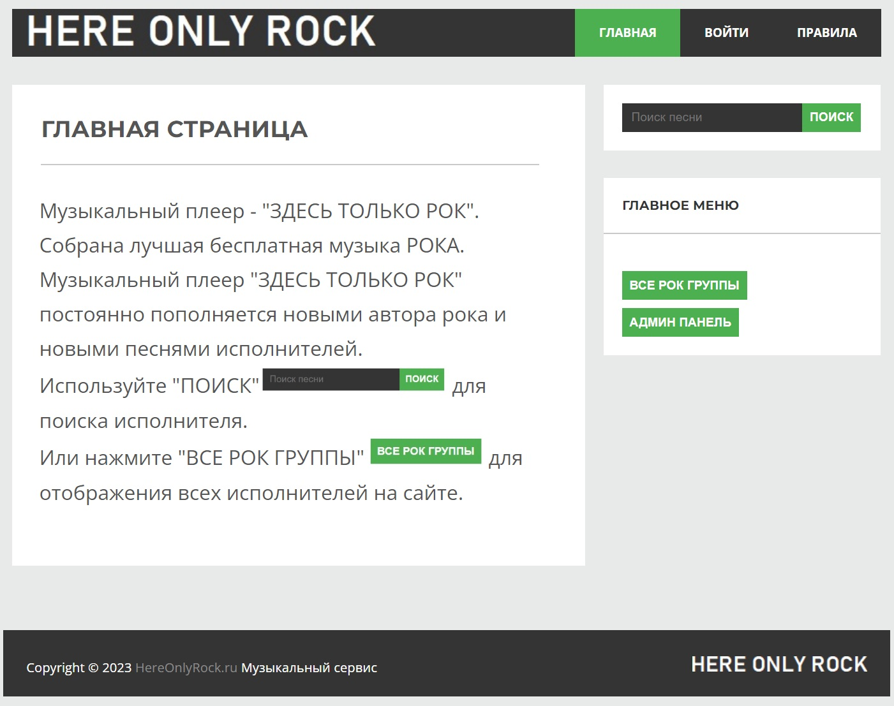
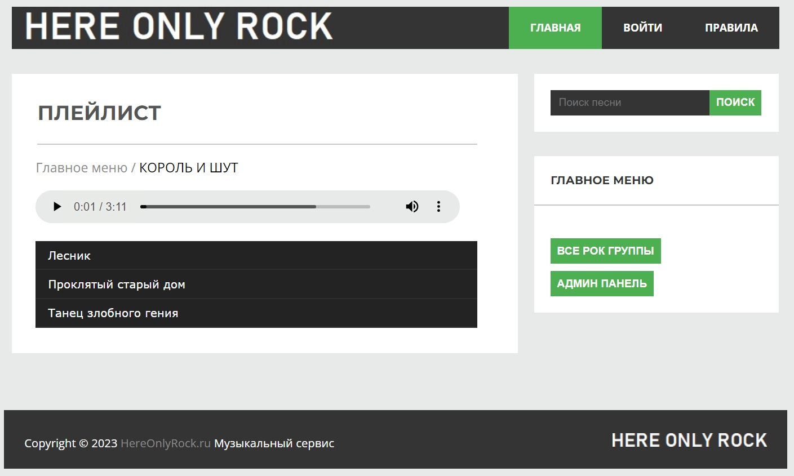
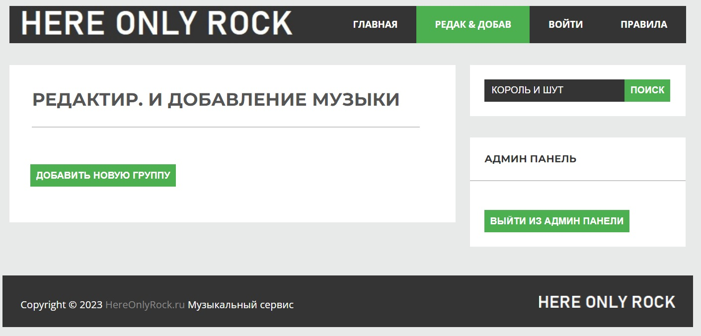
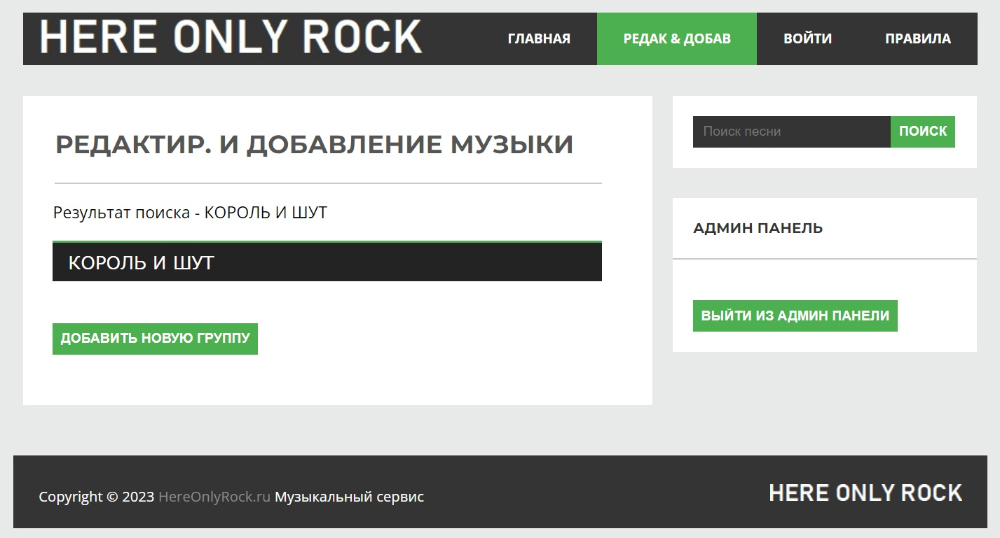
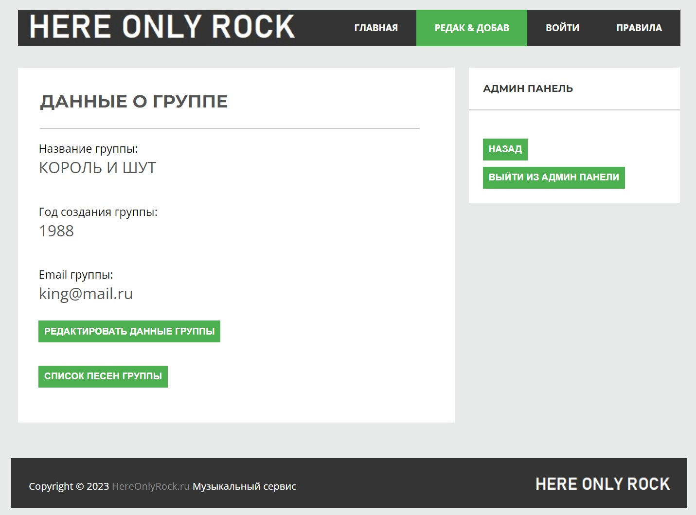
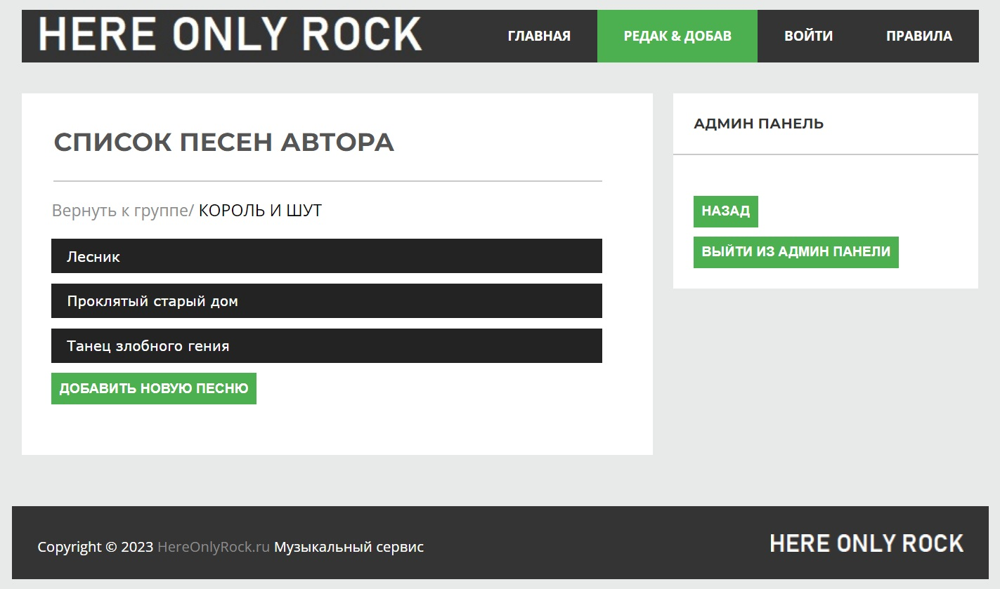
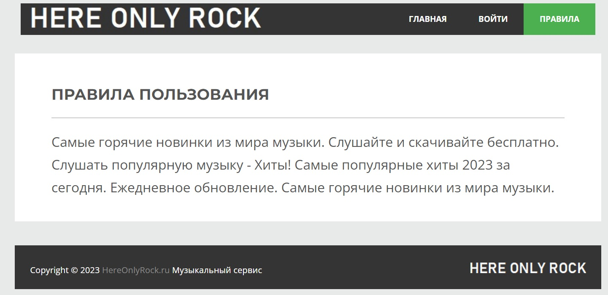

# Playlist - музыкальный веб-проигрывать рок-песен

Данный проект создан для обучения и практического применения полученных навыком.
Это простой музыкальный веб-проигрыватель музыки с возможностью поиска авторов.
Есть возможность регистрация пользователей, для ознакомления правил пользования сервисом и информацией пользования сервисом.

    В данной версии присутствует панель Администрирования, где есть возможность добавления/удаления/редактирования авторов и песен.

    В данном проекте использовалась БД на основе PostgreSQL

### Использованные технологии в проекте
* Java Core
* Spring Boot
* JPA Hibernate
* Thymeleaf

### Главная страница плейлиста

### Панель проигрывателя

### Панель Администрирования
* Добавление нового испонителя

* Поиск и выбор испонителя для редактирования

* Информация об исполнителе

* Список песен исполнителя

### Правила пользования
